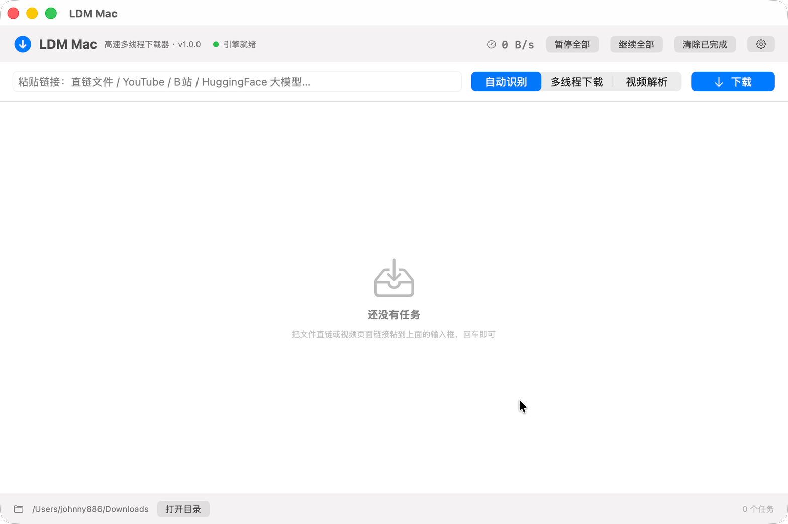

# LDM Mac

> **Lightning Download Manager** —— macOS 原生高速多线程下载器，把 aria2、yt-dlp、ffmpeg 这三个命令行神器，装进一个开箱即用的中文图形界面。

   



## 这是什么

**LDM = Lightning Download Manager（闪电下载器）**。

你在 Windows 上用习惯的那类多线程下载器（IDM、TDM Fast 之类），macOS 上一直缺一个好用的原生版本。LDM Mac 就是补这个位置：

- **SwiftUI 原生界面**，不是网页套壳，启动快、占用低
- **多线程分段下载**：单文件最多 64 段并行，断点续传
- **视频一键解析**：基于 yt-dlp，支持 YouTube、B站、X、TikTok、Reddit、Vimeo、Twitch 等 1800+ 站点，自动调用 ffmpeg 合并音视频轨输出 MP4
- **大文件友好**：HuggingFace、镜像站的大文件走分段下载
- **完全免费开源**，无广告、无捆绑、无登录、无遥测

## 安装

### 方式一：下载安装包（推荐）

到 [Releases](https://github.com/xiaodong886/ldm-mac/releases/latest) 下载 `LDM-Mac-1.0.0.dmg`，打开后把「LDM Mac」拖进「应用程序」文件夹。

> **首次打开被系统拦下**（提示“无法验证开发者”或“已损坏”，因为个人开发者没有苹果公证）：
> - 推荐：在「应用程序」里**右键点 LDM Mac → 打开 → 再点「打开」**，之后就不会再提示了
> - 或者终端执行一次：
>   ```bash
>   xattr -dr com.apple.quarantine "/Applications/LDM Mac.app"
>   ```

### 方式二：自己编译

```bash
git clone https://github.com/xiaodong886/ldm-mac.git
cd ldm-mac
./make_icon.sh          # 生成应用图标
VERSION=1.0.0 ./make_app.sh   # 编译并打包出 dist/LDM Mac.app
VERSION=1.0.0 ./make_dmg.sh   # 再打成 .dmg 安装包
```

只需要 Xcode Command Line Tools（`xcode-select --install`），**不需要**创建 Xcode 工程、不需要签名证书。

## 运行依赖

LDM Mac 自己不带下载内核，它调用系统里现成的三个开源工具（这样你也能随时 `brew upgrade` 升级它们）：

```bash
brew install aria2 yt-dlp ffmpeg
```

没装的话，App 的「设置 → 引擎依赖」会直接提示缺哪个，并提供**一键安装**按钮（会打开终端执行 brew）。

| 组件 | 作用 | 许可 |
|---|---|---|
| [aria2](https://github.com/aria2/aria2) | 多线程分段下载、断点续传、队列 | GPL-2.0 |
| [yt-dlp](https://github.com/yt-dlp/yt-dlp) | 视频站点解析 | Unlicense |
| [ffmpeg](https://ffmpeg.org/) | 音视频轨合并、格式转换 | LGPL/GPL |

## 使用

1. 把链接粘到输入框，回车或点「下载」
2. 模式三选一：
   | 模式 | 行为 |
   |---|---|
   | 自动识别 | 视频站点的链接走 yt-dlp 解析，其他链接走多线程下载 |
   | 多线程下载 | 强制分段下载（适合直链、镜像站、大模型文件） |
   | 视频解析 | 强制走 yt-dlp（适合链接长得不像视频页的站点） |
3. 任务行右侧按钮：暂停 / 继续、打开文件、在访达中显示、复制链接、删除
4. 「设置」里可以改：下载目录、每任务连接数（1~64）、同时下载任务数、代理、视频画质（最高画质自动合并 MP4 / 1080p 及以下 / 仅音频 mp3）

### 关于代理

- **B站、微博、国内镜像站**：直连即可，不用开代理
- **YouTube、X 等**：需要在「设置 → 网络」里打开「使用代理」，填本机代理地址（如 `http://127.0.0.1:7897`），然后点「重启引擎」生效

## 命令行自检（不用开界面）

App 二进制内置了无界面测试入口，方便验证下载内核是否正常：

```bash
# 多线程下载测试（打印实时进度、连接数、速度，并校验落盘大小）
./.build/release/LdmMac --selftest "https://example.com/big-file.zip" --dir /tmp/test --conn 16

# 视频解析测试（可用 LDM_TEST_PROXY 指定代理）
LDM_TEST_PROXY=http://127.0.0.1:7897 ./.build/release/LdmMac --selftest "https://www.youtube.com/watch?v=xxxx" --video --dir /tmp/test
```

实测数据（40MB 文件、16 线程、千兆以下家用宽带）：**1.6 秒完成，峰值 34.9 MB/s**。

## 技术实现

```
SwiftUI 界面
   └─ DownloadManager   设置持久化 · 任务列表合并 · 0.9s 轮询刷新 · 链接类型自动识别
        ├─ AriaEngine   aria2c 子进程 + JSON-RPC(127.0.0.1 随机端口 + token 鉴权)
        └─ VideoEngine  yt-dlp 子进程 + stdout 进度解析 + ffmpeg 合并
```

几个实现上的取舍：

- **内核用 aria2 而不是自己写**：分段、续传、重试、磁盘预分配、并发队列它都做得很成熟，自己写容易在边角情况下出错
- **用子进程 + JSON-RPC 而不是链接 aria2 的库**：进程隔离，aria2 崩了不会带走 App；同时用 `--stop-with-process` 保证 App 退出时内核一起退出，不留孤儿进程
- **不打包内核**：避免 GPL 传染与体积膨胀，用户自己 brew 装、自己升级

## 项目结构

```
Sources/LdmMac/
├── LdmMacApp.swift       App 入口、菜单、退出确认、依赖一键安装
├── Views.swift           界面：任务列表、进度条、设置面板
├── DownloadManager.swift 调度中枢：设置、轮询、任务合并
├── AriaEngine.swift      aria2c 子进程 + JSON-RPC 客户端
├── VideoEngine.swift     yt-dlp 子进程 + 进度解析
├── Models.swift          数据模型与格式化
└── SelfTest.swift        --selftest 无界面验证入口
make_app.sh               编译 + 打包 .app
make_dmg.sh               打包 .dmg 安装包
make_icon.sh              生成 .icns 图标
```

## 常见问题

**Q：提示“已损坏，无法打开”？**
不是文件坏了，是系统对未公证应用的拦截。右键 → 打开，或执行 `xattr -dr com.apple.quarantine "/Applications/LDM Mac.app"`。

**Q：引擎未就绪 / 找不到 aria2c？**
`brew install aria2 yt-dlp ffmpeg`，或在设置里点一键安装，装完点「重启引擎」。

**Q：下载速度没有跑满？**
先看任务行显示的连接数。若一直是 1 连接，说明该服务器不支持分段（不少网盘/限速站点如此），这不是线程数能解决的。支持分段的站点把连接数设到 8~16 通常就能跑满带宽，再往上收益很小。

**Q：YouTube 报错？**
YouTube 需要代理，且 yt-dlp 需要保持较新版本（`brew upgrade yt-dlp`）。站点规则变化频繁，遇到解析失败先升级 yt-dlp。

**Q：视频任务为什么不能暂停续传？**
yt-dlp 本身不支持暂停恢复，只能停止后重新添加。多线程文件任务支持完整的暂停/续传。

**Q：关掉窗口下载会中断吗？**
有任务在下载时点关闭或退出，会弹确认框；退出会导致下载中断（重新添加同一链接可断点续传）。

## 已知限制

- 没有浏览器扩展/视频嗅探按钮，需要手动复制链接
- 视频任务提交后不能暂停
- 未做代码签名与公证（需要付费的 Apple 开发者账号），首次打开需要用户手动放行
- 只支持 macOS 14 (Sonoma) 及以上、Apple Silicon

## Roadmap

- [ ] Safari / Chrome 浏览器扩展：页面视频嗅探、右键“用 LDM 下载”
- [ ] 下载完成系统通知（通知中心）
- [ ] 多语言界面（English）
- [ ] Homebrew Cask 分发：`brew install --cask ldm-mac`
- [ ] 应用公证（Developer ID）

## 致谢

灵感来自 Windows 上那些经典的多线程下载器。本项目为独立实现，基于以下开源项目构建：aria2（GPL-2.0）、yt-dlp（Unlicense）、ffmpeg（LGPL/GPL）。它们以独立进程方式被调用，不随本项目分发。

## License

[MIT](LICENSE) © 2026
