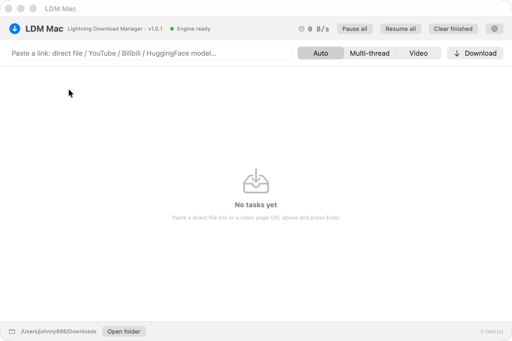
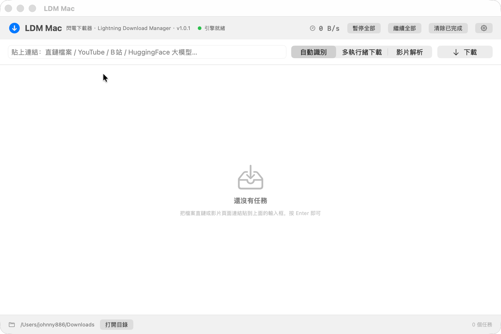
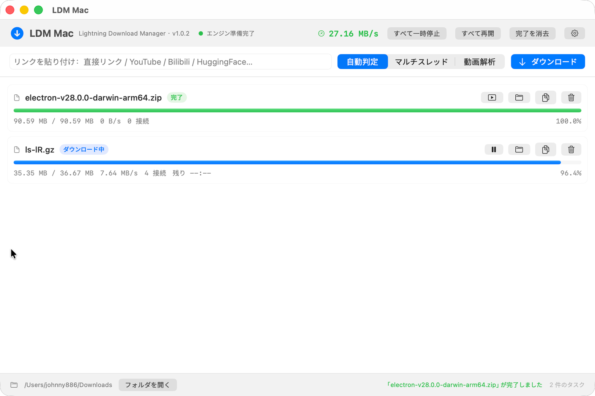
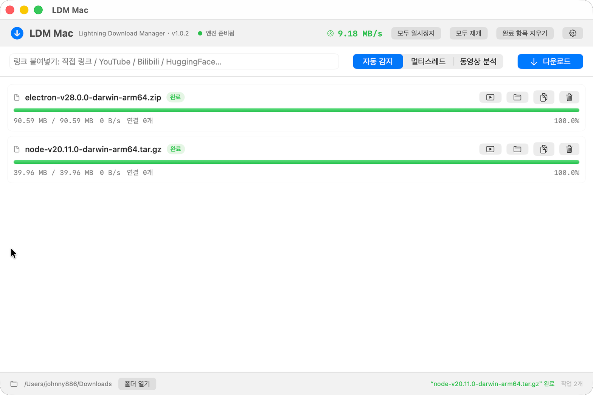

# LDM Mac

> **Lightning Download Manager** —— macOS 原生高速多线程下载器，把 aria2、yt-dlp、ffmpeg 这三个命令行神器，装进一个开箱即用的图形界面，再配一个能嗅探网页视频的浏览器扩展（Chrome / Firefox）。

    


## 这是什么

**LDM = Lightning Download Manager（闪电下载器）**。

你在 Windows 上用习惯的那类多线程下载器（IDM、TDM Fast 之类），macOS 上一直缺一个好用的原生版本。LDM Mac 就是补这个位置：

- **SwiftUI 原生界面**，不是网页套壳，启动快、占用低
- **多线程分段下载**：单文件最多 64 段并行，断点续传
- **视频一键解析**：基于 yt-dlp，支持 YouTube、B站、X、TikTok、Reddit、Vimeo、Twitch 等 1800+ 站点，自动调用 ffmpeg 合并音视频轨输出 MP4
- **浏览器扩展（Chrome / Firefox 双版本）**：页面视频嗅探（含 HLS/m3u8 分片流）+ 右键「用 LDM 下载」，链接连同 Referer、Cookie 一键送进 App
- **下载完成系统通知**：通知中心提醒，可在设置里关掉
- **五语言界面**：简体中文 / 繁體中文 / English / 日本語 / 한국어，跟随系统或手动切换
- **大文件友好**：HuggingFace、镜像站的大文件走分段下载
- **完全免费开源**，无广告、无捆绑、无登录、无遥测

## 安装

### 方式一：下载安装包（推荐）

到 [Releases](https://github.com/ikun88996/ldm-mac/releases/latest) 下载 `LDM-Mac-1.0.6.dmg`（版本号以 Releases 页面为准，用 `latest` 链接永远拿到最新版），打开后：

1. 把「LDM Mac」拖进「Applications」
2. 首次打开若被系统拦下（提示“无法验证开发者”或“已损坏”，因为个人开发者没有苹果公证）：
   - 推荐：在「应用程序」里**右键点 LDM Mac → 打开 → 再点「打开」**
   - 或者终端执行一次：
     ```bash
     xattr -dr com.apple.quarantine "/Applications/LDM Mac.app"
     ```
3. 装依赖：`brew install aria2 yt-dlp ffmpeg`（也可以在 App 的「设置 → 引擎依赖」里点一键安装）
4. 想要网页视频嗅探，再装浏览器扩展（Chrome / Firefox 的 zip 都在 Releases 里，DMG 里也带了）

### 方式二：自己编译

```bash
git clone https://github.com/ikun88996/ldm-mac.git
cd ldm-mac
./make_icon.sh                     # 生成应用图标
VERSION=1.0.6 ./make_extension.sh   # 打包 Chrome + Firefox 两套扩展
VERSION=1.0.6 ./make_app.sh         # 编译并打包 dist/LDM Mac.app
VERSION=1.0.6 ./make_dmg.sh         # 打成 .dmg 安装包（内含 App + 两套扩展）
```

只需要 Xcode Command Line Tools（`xcode-select --install`），**不需要**创建 Xcode 工程、不需要签名证书。

## 运行依赖

LDM Mac 自己不带下载内核，它调用系统里现成的三个开源工具（这样你也能随时 `brew upgrade` 升级它们）：

```bash
brew install aria2 yt-dlp ffmpeg
```

| 组件 | 作用 | 许可 |
|---|---|---|
| [aria2](https://github.com/aria2/aria2) | 多线程分段下载、断点续传、队列 | GPL-2.0 |
| [yt-dlp](https://github.com/yt-dlp/yt-dlp) | 视频站点解析 | Unlicense |
| [ffmpeg](https://ffmpeg.org/) | 音视频轨合并、格式转换 | LGPL/GPL |

## 使用

1. 把链接粘到输入框，回车或点「下载」
2. 模式三选一：
   | 模式 | 行为 |
   |---|---|
   | 自动识别 | 视频站点的链接走 yt-dlp 解析，其他链接走多线程下载 |
   | 多线程下载 | 强制分段下载（适合直链、镜像站、大模型文件）；若识别到是视频页面会自动改用视频解析并提示 |
   | 视频解析 | 强制走 yt-dlp（适合链接长得不像视频页的站点） |
3. 任务行右侧按钮：暂停 / 继续、打开文件、在访达中显示、复制链接、删除
4. 「设置」里可以改：**界面语言**、**完成通知开关**、下载目录、每任务连接数（1~64）、同时下载任务数、代理、视频画质

### 界面语言

五套完整文案：简体中文 / 繁體中文 / English / 日本語 / 한국어。「设置 → 通用 → 界面语言」里切换（默认跟随系统），切换后立即生效、无需重启。

| English | 繁體中文 |
|---|---|
|  |  |

| 日本語 | 한국어 |
|---|---|
|  |  |

### 下载完成通知

首次启动会申请通知权限，允许后每次下载完成都会在**通知中心**弹一条横幅（含文件名和大小），App 在前台时也会弹。不想被打扰就在「设置 → 通用」里关掉「下载完成后发送系统通知」。

如果第一次误点了「不允许」，去 **系统设置 → 通知 → LDM Mac** 里重新打开即可。

### 关于代理

- **B站、微博、国内镜像站**：直连即可，不用开代理
- **YouTube、X 等**：需要在「设置 → 网络」里打开「使用代理」，填本机代理地址（如 `http://127.0.0.1:7897`），然后点「重启引擎」生效

## 浏览器扩展

同一套代码，两套 manifest，随每个 Release 一起发布（文件名带版本号）：`LDM-Mac-Chrome-Extension-<版本>.zip` 与 `LDM-Mac-Firefox-Extension-<版本>.zip`。当前版本为 **1.0.6**。

功能：

- **页面视频嗅探**：右下角浮出按钮显示检测到的媒体数量，点开是候选列表（HLS 分片流优先），逐项下载
- **右键菜单**：链接 / 视频 / 选中文本 / 整页，四种上下文都能「用 LDM 下载」
- **整页交给 yt-dlp**：B站、YouTube 这类页面直接解析，拿到最高画质
- **弹窗面板**：看 App 连接状态、任务进度，能暂停 / 继续 / 删除
- **自动带上 Referer 与 Cookie**：很多站点的媒体直链需要登录态才能下，扩展会自动把当前站点的 Cookie 一起送给 App

### 安装步骤

先启动 **LDM Mac.app**（扩展需要 App 在运行），然后：

| 浏览器 | 步骤 |
|---|---|
| Chrome / Edge | 打开 `chrome://extensions` → 开启右上角**开发者模式** → **加载已解压的扩展程序** → 选 `chrome` 子目录 |
| Firefox | 打开 `about:debugging#/runtime/this-firefox` → **临时载入附加组件** → 选 `firefox/manifest.json` |

扩展目录位置（DMG 里叫 `LDM-Mac-Browser-Extensions`）：

- 从 DMG 安装：选 DMG 里的 `LDM-Mac-Browser-Extensions/chrome` 或 `.../firefox/manifest.json`
- 已拖进应用程序：在 App 里点「设置 → 浏览器扩展 → 打开扩展文件夹」，会定位到 App 包内自带的那份

> Firefox 说明：临时载入的扩展在重启浏览器后会失效，需要重新载入；要长期使用可以自行打包签名，或者用 [Developer Edition 的签名流程](https://extensionworkshop.com/documentation/publish/)。

详细说明见 [`extension/README.md`](extension/README.md)。

## 本机接口（扩展与 App 怎么通信）

App 启动后会在 `127.0.0.1:47823` 起一个只监听本机的 HTTP 接口（被占用时顺延到 47824/47825），扩展通过它下发任务。接口很简单，你也可以用 curl 或自己的脚本调：

| 方法 | 路径 | 说明 |
|---|---|---|
| GET | `/ping` | 探活，返回 `{ok, name, version}` |
| POST | `/add` | 添加任务，body：`{url, kind: auto\|file\|video, referer?, cookies?, filename?}` |
| GET | `/tasks` | 当前任务列表（含进度、速度、连接数） |
| POST | `/task` | 任务操作，body：`{id, action: pause\|resume\|remove\|open\|reveal}` |

```bash
# 探活
curl http://127.0.0.1:47823/ping
# 让 App 多线程下载一个文件（16 连接）
curl -X POST http://127.0.0.1:47823/add \
  -H 'Content-Type: application/json' \
  -d '{"url":"https://example.com/big.zip","kind":"file"}'
```

> 接口只绑定回环地址、不对外网开放；请求里的 Cookie 只会留在本机，用于你正在下载的那个站点。

## 命令行自检

App 二进制内置了无界面自检入口，方便验证内核与文案：

```bash
# 多线程下载测试（打印实时进度、连接数、速度，并校验落盘大小）
./.build/release/LdmMac --selftest "https://example.com/big-file.zip" --dir /tmp/test --conn 16

# 视频解析测试（可用 LDM_TEST_PROXY 指定代理）
LDM_TEST_PROXY=http://127.0.0.1:7897 ./.build/release/LdmMac --selftest "https://www.youtube.com/watch?v=xxxx" --video --dir /tmp/test

# 五语言文案完整性检查
./.build/release/LdmMac --i18n-check

# 扩展测试：纯函数 + 「扩展 → 本机接口 → aria2/yt-dlp」整条链路（需 App 在运行）
node scripts/test-extension.js

# 扩展的 DOM 级测试（需要 jsdom）：媒体嗅探 → 浮层 → 点击下载真的进 App
npm install --prefix /tmp/ldm-ext-test jsdom && node scripts/test-content-dom.js

# Firefox 扩展用 Mozilla 官方 linter 校验
npx web-ext lint --source-dir build/extensions/firefox
```

实测数据（40MB 文件、16 线程、家用宽带）：**1.6 秒完成，峰值 34.9 MB/s**。

## 技术实现

```
SwiftUI 界面（五语言）
   └─ DownloadManager   设置持久化 · 任务列表合并 · 0.9s 轮询刷新 · 链接类型自动识别
        ├─ AriaEngine          aria2c 子进程 + JSON-RPC(127.0.0.1 随机端口 + token 鉴权)
        ├─ VideoEngine         yt-dlp 子进程 + stdout 进度解析 + ffmpeg 合并
        ├─ Notifier            下载完成 → 通知中心（UNUserNotificationCenter）
        └─ LocalAPIServer      本机 HTTP 接口（浏览器扩展入口，只监听回环）

浏览器扩展 (MV3，Chrome / Firefox 共用代码)
   ├─ background.js   右键菜单 · Cookie/Referer 收集 · 与 App 通信 · 角标
   ├─ content.js      媒体嗅探（DOM + performance + 页面源码）· 浮层 UI
   └─ popup.html/js   App 状态 · 任务进度 · 当前页媒体列表
```

几个实现上的取舍：

- **内核用 aria2 而不是自己写**：分段、续传、重试、磁盘预分配、并发队列它都做得很成熟，自己写容易在边角情况下出错
- **用子进程 + JSON-RPC 而不是链接 aria2 的库**：进程隔离，aria2 崩了不会带走 App；同时用 `--stop-with-process` 保证 App 退出时内核一起退出，不留孤儿进程
- **不打包内核**：避免 GPL 传染与体积膨胀，用户自己 brew 装、自己升级
- **多语言用内置字典而不是 .lproj**：不需要 Xcode 的本地化工程，`--i18n-check` 还能自动查出漏翻字段
- **通知做了 bundle 判断**：`UNUserNotificationCenter` 在非 .app 进程里调用会崩，所以命令行自检永远不会触发通知

## 项目结构

```
Sources/LdmMac/
├── LdmMacApp.swift        App 入口、菜单、退出确认
├── Views.swift            界面：任务列表、进度条、设置面板
├── Localization.swift     五语言文案表（84 条 key × 5 语言）
├── DownloadManager.swift  调度中枢：设置、轮询、任务合并、扩展接口处理
├── AriaEngine.swift       aria2c 子进程 + JSON-RPC 客户端
├── VideoEngine.swift      yt-dlp 子进程 + 进度解析
├── LocalAPIServer.swift   本机 HTTP 接口
├── Notifier.swift         下载完成系统通知
├── Models.swift           数据模型与格式化
└── SelfTest.swift         --selftest / --i18n-check 入口

extension/
├── shared/                两个浏览器共用的代码 + 5 种语言包
├── manifests/chrome.json  MV3 + background.service_worker
└── manifests/firefox.json MV3 + background.scripts（Firefox 不支持 service worker）
scripts/test-extension.js / test-content-dom.js   扩展的两层自动化测试
make_app.sh / make_dmg.sh / make_extension.sh / make_icon.sh
```

## 常见问题

**Q：提示“已损坏，无法打开”？**
不是文件坏了，是系统对未公证应用的拦截。右键 → 打开，或执行 `xattr -dr com.apple.quarantine "/Applications/LDM Mac.app"`。

**Q：没有收到下载完成通知？**
第一次启动会弹权限申请，如果误点了拒绝：**系统设置 → 通知 → LDM Mac → 允许通知**。也可以在 App 的「设置 → 通用」里确认开关是打开的。

**Q：Firefox 扩展重启浏览器后就没了？**
`about:debugging` 里的「临时载入」本来就是会话级的，重启需重新载入。想长期常驻需要签名打包。

**Q：扩展里显示「LDM Mac 未运行」？**
先启动 App；扩展只连本机 `127.0.0.1:47823`，如果 App 报「本机接口未启动」，多半是端口被别的程序占了，重启 App 会自动顺延到 47824。

**Q：微博视频下载失败，或者只下到一个叫 `visitor` 的奇怪文件？**
这是 1.0.3 修掉的老问题：微博的页面链接被当普通文件交给 aria2，微博会把它跳转到访客登录页，于是只存下一个 9 KB 的 HTML（文件名叫 `visitor`）。1.0.3 起：多线程模式识别到视频页面会自动改用视频解析；已经下到网页的任务也会被清理掉并按需要用 yt-dlp 重试（1.0.4 起这类任务会留在列表里标红说明原因，不再静默消失）。如果你还想要那个原视频，把链接重新粘一遍（用「视频解析」模式）即可。

**Q：微博短链（`t.cn/xxxx`）下不了，报 `Unsupported URL: passport.weibo.com/visitor/...`？**
1.0.4 起已自动处理：短链里带的真实视频地址会被解包出来并自动重试，列表里最终会看到视频标题。如果仍然失败，说明这个地址可能真的要登录态——在浏览器扩展里把该站点的 Cookie 一并带上再试，或者把链接发我。

**Q：下载失败的任务去哪看？**
失败的任务会**留在列表里**，状态标红「出错」，并在任务行下面写明失败原因。以前的版本会把「下到网页」的任务静默删掉，1.0.4 起不会再消失。

**Q：网页视频点下载后失败？**
很多站点的媒体地址需要登录态或短时效签名。扩展会自动带上当前站点 Cookie；若是签名过期（返回 403），重新在页面上播放一下再点下载。

**Q：引擎未就绪 / 找不到 aria2c？**
`brew install aria2 yt-dlp ffmpeg`，或在设置里点一键安装，装完点「重启引擎」。

**Q：下载速度没有跑满？**
先看任务行显示的连接数。若一直是 1 连接，说明该服务器不支持分段（不少网盘/限速站点如此），这不是线程数能解决的。支持分段的站点把连接数设到 8~16 通常就能跑满带宽，再往上收益很小。

**Q：YouTube 报错？**
YouTube 需要代理，且 yt-dlp 需要保持较新版本（`brew upgrade yt-dlp`）。站点规则变化频繁，遇到解析失败先升级 yt-dlp。

**Q：视频任务为什么不能暂停续传？**
yt-dlp 本身不支持暂停恢复，只能停止后重新添加。多线程文件任务支持完整的暂停/续传。

**Q：关掉窗口下载会中断吗？**
有任务在下载时点关闭或退出，会弹确认框；退出会导致下载中断（重新添加同一链接可断点续传）。

## 更新日志

### v1.0.6
- 🐛 **「先失败再成功」的两条任务 → 合成一条**：微博短链这类情况现在**同一条任务就地重试**，列表里只有一条任务从「解析中…」走到「已完成」，不会再多出红色失败行，连一帧红闪都没有（根因是老 yt-dlp 进程退出时的回调会把新任务的状态覆盖回「出错」，已切断）
- 🐛 **修复「同一条链接第二次下载就失败」**：防重复重试之前按**链接**记，导致同一条链接第二次下载时救援被跳过；现在按**任务**记，每次都能救回来
- 🐛 **修复偶发崩溃**：aria2 在状态切换瞬间可能把同一个任务同时列进「等待」和「已停止」，字典重复键会让 App 直接崩（崩溃报告 `EXC_BREAKPOINT @ DownloadManager.apply`），已改为安全合并
- 🔌 本机接口 `/tasks` 返回 `message` 字段（失败原因），方便扩展与脚本排查

### v1.0.5
- 💬 微博短链这种「先失败 → 自动还原真实地址重试成功」的任务，失败那一行现在写明**「已从跳转地址还原真实视频地址，自动重试」**，不再直接甩 yt-dlp 的 `Unsupported URL: passport.weibo.com/...` 原文，免得看着以为白下了
- 🔌 本机接口 `/tasks` 增加 `message` 字段（失败原因），方便扩展和脚本排查

### v1.0.4
- 🐛 **修复微博短链（`t.cn/xxxx`）下载失败**：yt-dlp 跟着短链跳转时会被微博的访客系统拦到 `passport.weibo.com/visitor/visitor`，报 `Unsupported URL: passport.weibo.com/...`
  - 提交链接时先解包微博访客跳转地址，直接取出里面的真实视频地址
  - 视频任务失败但报错里带着真实地址时，**自动用真实地址重试一次**，你不用做任何操作
  - `t.cn`、`dwz.cn`、`v.douyin.com` 等短链自动识别为视频页面，不再按多线程直链下载
- 🐛 **修复「下载失败却提示已完成」**：以前失败任务也会弹「已完成」+ 系统通知，现在成功报成功、失败报失败（通知标题为「下载失败」）
- 🐛 **失败任务一定留在列表里**：下到网页的任务不再静默消失，而是留在列表标红「出错」并写明原因（如「这个链接是网页而不是文件」）
- 💬 失败任务的标题不再显示「解析中…」，改成链接或文件名，一眼看出是哪条
- 🌐 视频引擎的状态文案（正在解析 / 合并音视频 / 转换格式 / 处理中…）全部接入五语言

### v1.0.3
- 🐛 **修复微博（及同类站点）视频下载失败**：页面链接被当成普通文件丢给 aria2，微博会把请求跳转到 `passport.weibo.com/visitor/visitor`，结果只下到一个名为 `visitor` 的 9 KB 登录页 HTML
  - 「多线程下载」模式下识别到视频页面时，自动改用「视频解析」并提示
  - 新增兜底：任务完成后检查文件内容，若下到的其实是网页（`<!DOCTYPE html>`），自动删除并改用 yt-dlp 重试；不是视频站则明确提示「这是网页不是文件」
- ✨ 视频任务现在会把扩展送来的 **Referer 与 Cookie** 交给 yt-dlp（写成临时 Netscape Cookie 文件，任务结束即删除），需要登录态的微博/站点视频也能解析
- ✨ 文案扩到 87 条 × 5 语言

### v1.0.2
- ✨ 新增 **Firefox 扩展**（MV3），与 Chrome 扩展共用一套代码、各自 manifest（Firefox 用 `background.scripts`）
- ✨ 新增**下载完成系统通知**（通知中心横幅，含文件名与大小；设置里可关）
- ✨ 界面语言扩展到 **5 种**：新增 日本語、한국어（App 与扩展语言包同步）
- ✨ 扩展目录重构为 `shared/` + `manifests/`，一套代码产出 Chrome / Firefox 两个包
- ✨ Firefox 扩展通过 Mozilla 官方 `web-ext lint`：**0 error**（仅 2 条最低版本声明提示）
- 📄 扩展新增 `data_collection_permissions` 声明（不收集任何数据），为将来上架 AMO 做准备

### v1.0.1
- ✨ 新增 Chrome 浏览器扩展：页面视频嗅探（含 HLS）、右键菜单、任务弹窗，自动携带 Referer/Cookie
- ✨ App 内置本机 HTTP 接口（`127.0.0.1:47823`）
- ✨ 三语言界面：简体中文 / 繁體中文 / English
- 🐛 修复退出后残留孤儿 aria2c 进程的问题（改用 `--stop-with-process`）

### v1.0.0
- 首个公开版本：多线程分段下载、断点续传、YouTube/B站等视频解析合并 MP4、依赖一键安装

## Roadmap

- [ ] Homebrew Cask 分发：`brew install --cask ldm-mac`
- [ ] 应用公证（Developer ID），免去首次打开手动放行
- [ ] 边下边播（预览未完成的视频文件）
- [ ] 任务限速与时段限制

## English

**LDM Mac — a native macOS download manager** (Lightning Download Manager), built with SwiftUI, powered by aria2 (multi-threaded segmented download), yt-dlp + ffmpeg (video extraction, 1800+ sites), plus **Chrome and Firefox extensions** that sniff page videos and send links (with Referer & cookies) into the app, and **Notification Center alerts** when a download finishes.

```bash
brew install aria2 yt-dlp ffmpeg   # required runtime dependencies
```

1. Download `LDM-Mac-1.0.6.dmg` from [Releases](https://github.com/ikun88996/ldm-mac/releases/latest), drag the app into Applications.
2. First launch blocked by Gatekeeper? Right-click → Open, or `xattr -dr com.apple.quarantine "/Applications/LDM Mac.app"`.
3. Browser extension (keep the app running — it listens on `http://127.0.0.1:47823`):
   - Chrome/Edge: `chrome://extensions` → Developer mode → Load unpacked → the `chrome` folder
   - Firefox: `about:debugging` → Load Temporary Add-on → `firefox/manifest.json`
4. UI available in **English, Simplified & Traditional Chinese, Japanese, Korean**.

## 致谢

灵感来自 Windows 上那些经典的多线程下载器。本项目为独立实现，基于以下开源项目构建：aria2（GPL-2.0）、yt-dlp（Unlicense）、ffmpeg（LGPL/GPL）。它们以独立进程方式被调用，不随本项目分发。

## License

[MIT](LICENSE) © 2026
